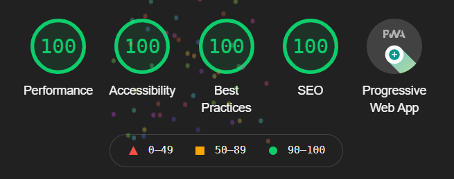
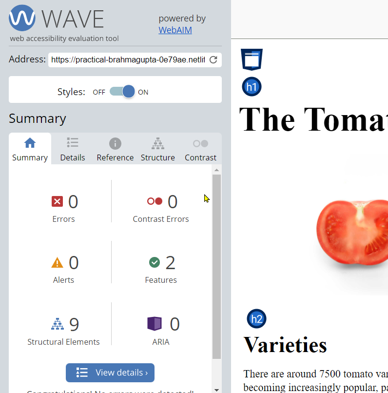
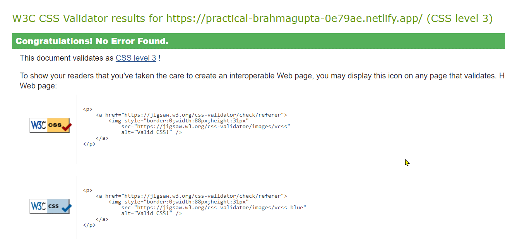
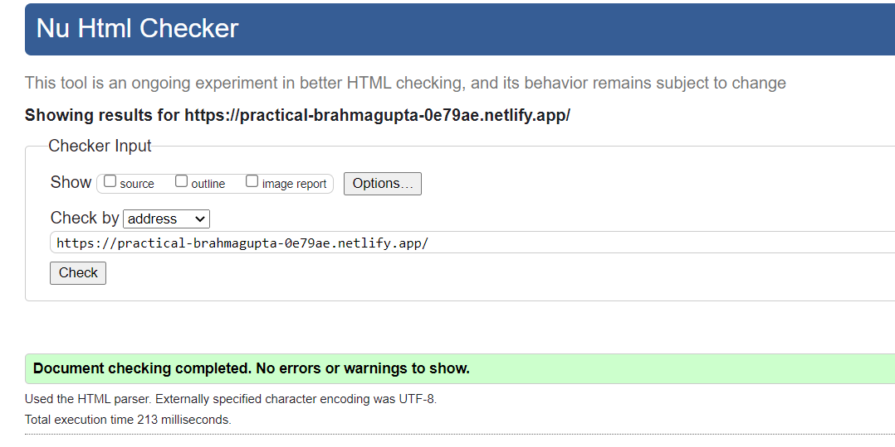

# The Tomato Page
Tech task to convert Tomato PDF page to React Web App.

 

## Process from PDF to Build
- Extracted text from pdf tomato page to save to JSON files to support scalability.
- Optimised tomato image file size from 215kb to 60kb, keeping original high-res dimensions to support retina devices.
- Created rough layout in css with divs and placeholders, including tomato view page.
- Built scalable components; table, tab, form for tomato page view with data input from JSON files.
- Further development.
- Final testing.

 

## Features
- scalable app
- Custom fav icon
- Lazyloading for image and components
- PWA compliant
- Lighthouse testing pass
- HTML testing pass
- CSS testing pass
- Accesability testing pass

 

## Testing Results
Google Lighthouse 

[Accessiblity Testing Link](https://wave.webaim.org/report#/https://practical-brahmagupta-0e79ae.netlify.app/)

[CSS Testing Link](https://jigsaw.w3.org/css-validator/validator?profile=css3&warning=0&uri=https://practical-brahmagupta-0e79ae.netlify.app/)

[HTML Testing Link](https://validator.w3.org/nu/?doc=https://practical-brahmagupta-0e79ae.netlify.app/)

## Author
Rishi Singh Bhachu
